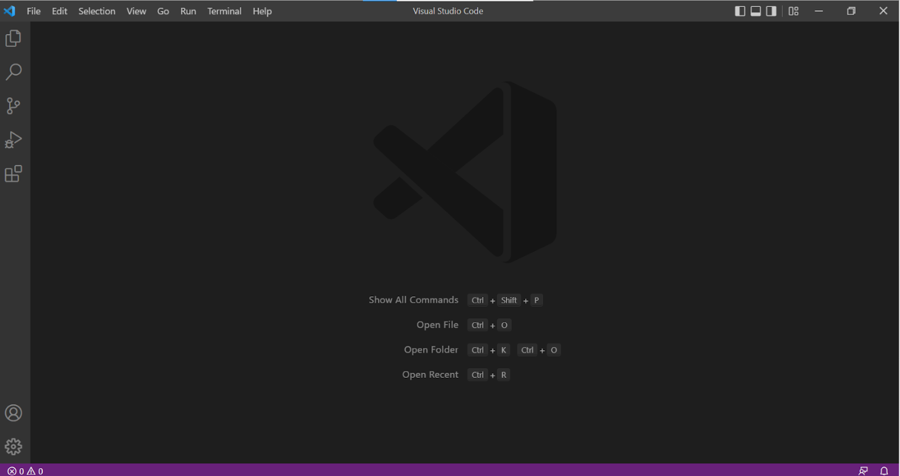
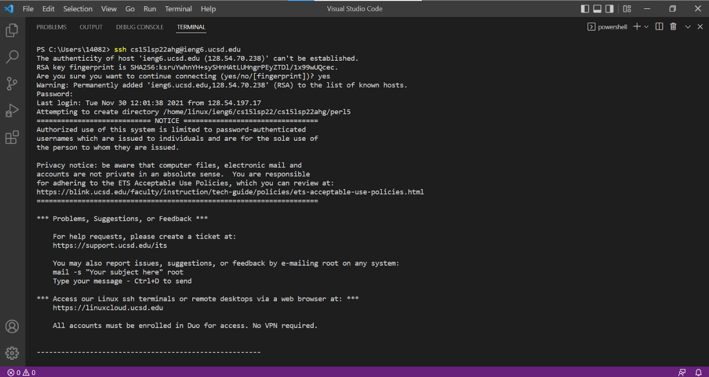
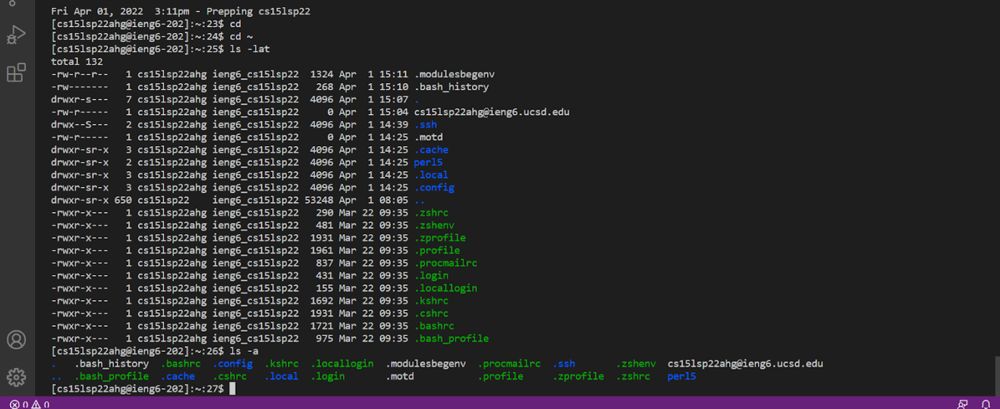
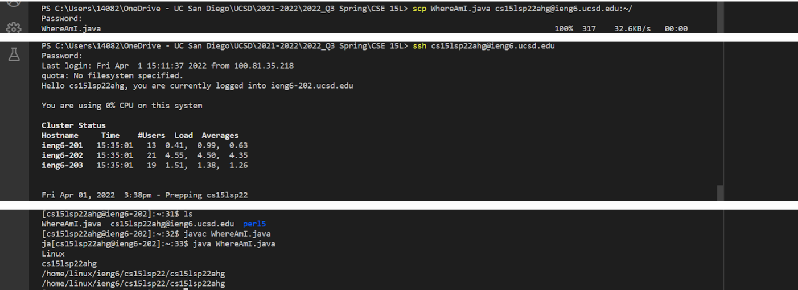
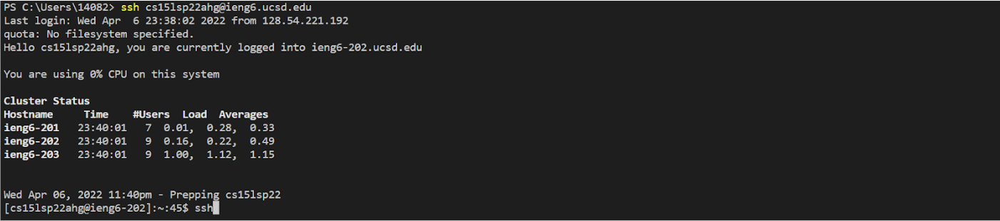
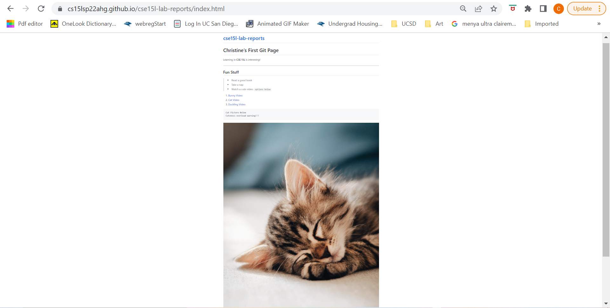

# [Lab Report 1](lab-report-1-week-2.html)

## Installing VSCode
>
>- I chose a password for logging in to the host computer ieng6.ucsd.edu. 
>- I downloaded Virtual Studio Code from online and installed the suggested extensions. 
>- I then opened the terminal and continued following the Lab 1 instructions.

## Remotely Connecting
>
>- I found my username@host as `cs15lsp22ahg@ieng6.ucsd.edu`.
>- I then tried to log in to my assigned account on the ieng6.ucsd.edu host computer.
>- The password chosen before downloading VS Code worked.

## Trying Some Commands
>
>I tried the following commands:
```
1. cd      - this did nothing
2. cd ~    - this changes the directory to the default root directly
3. ls -lat - unknown
4. ls -a   - shows all files including hidden ones in the directory, the green are the the hidden files/directories, and the blue are the directories
```

## Moving Files with `scp`
>
>- I added the file WhereAmI.java on my computer.
>- I compiled it and then used scp to transfer it to the ieng6.ucsd.edu host computer.
>- I then logged in to the host computer and ran the program on it.

## Setting an SSH Key
>


## Optimizing Remote Running
>