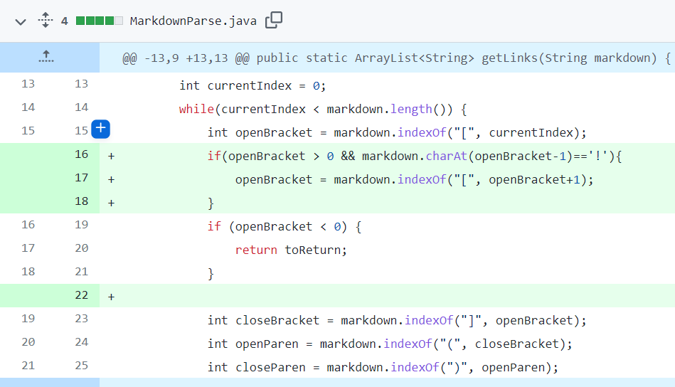

# [Lab Report 2](lab-report-2-week-4.html)

## __Code Change 1__
>[Commit with Fix Part 1](https://github.com/katieki/markdown-parser/commit/60e824a454c660a0e3602ecc67dc65e53082ff69)   
>[Commit with Fix Part 2](https://github.com/katieki/markdown-parser/commit/4bd8bf81655694b30db092140d56f78b7316ee4b)
>
>Note: 2 edits were made to fix this error

>[Commit with Error](https://github.com/katieki/markdown-parser/commit/5f7bf972d79864ea642c971cab6749c39eb4c445)
>### Error Message:
>

>Test File used:
>
>Corrected Output:   
>```[https://something.com, some-thing.html]```

>__Bug:__ Code was not designed to accommodate cases where there was anything after the last link, resulting in an unintended infinite loop.  
>__Symptom:__ OutOfMemoryError was thrown due to the fact that the bug came from a failure to reach an ending condition, resulting in an infinite loop and therefore the ArrayList ran out of memory.   
>__Failure-inducing Input:__ If there were any characters after the last link, the infinite loop would occur. 

## __Code Change 2__
>[Commit with Fix](https://github.com/katieki/markdown-parser/commit/8747fdc45a7e70d63399ccf797944d69cb29b4a7)   
>

>[Commit with Incorrect Output](https://github.com/katieki/markdown-parser/commit/4bd8bf81655694b30db092140d56f78b7316ee4b)
>### Incorrect Output
>```[https://something.com, ./Screen%20Shot%202022-04-15%20at%203.14.56%20PM.png, some-thing.html, gmail.com]```

>Test File used:
>
>Corrected Output:   
>```[https://something.com, some-thing.html, gmail.com]```

>__Bug:__ Code treated images the same way as links even though it should not.  
>__Symptom:__ Contents of images also showed up as links in the output.  
>__Failure-inducing Input:__ Any Markdown files with images. 

## __Code Change 3__
>[Commit with Fix](https://github.com/katieki/markdown-parser/commit/08b1902554e6e590be42e2b77be7cabdfae01bbc)   
>

>[Commit with IncorrectOutput](https://github.com/katieki/markdown-parser/commit/8747fdc45a7e70d63399ccf797944d69cb29b4a7)
>### Incorrect Output:
>```[https://something.com```   
>```[link2](some-thing.html, gmail.com]```

>Test File used:
>
>Corrected Output:   
>```[some-thing.html, gmail.com]```

>__Bug:__ Failed link syntax would still register as a link.
>__Symptom:__ When one parenthesis was removed it still registered whatever came after as a link.    
>__Failure-inducing Input:__ If there was a parenthesis removed it would still find the next parenthesis and include everything between as a link.