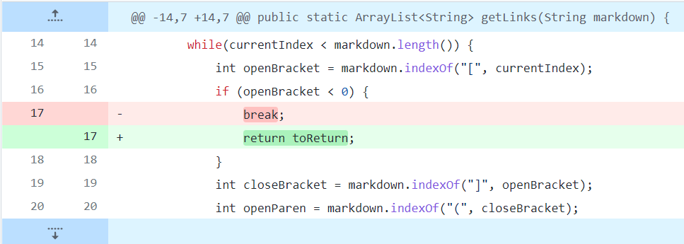
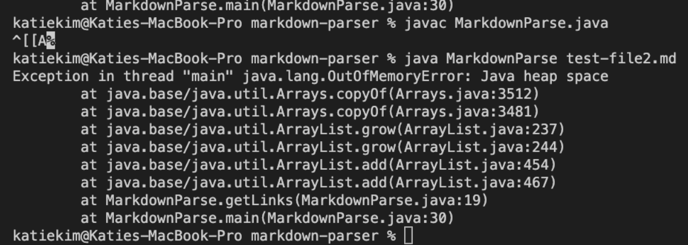

# [Lab Report 2](lab-report-2-week-4.html)

## __Code Change 1__
>[Commit with Fix Part 1](https://github.com/katieki/markdown-parser/commit/60e824a454c660a0e3602ecc67dc65e53082ff69)   
>[Commit with Fix Part 2](https://github.com/katieki/markdown-parser/commit/4bd8bf81655694b30db092140d56f78b7316ee4b)
>
>Note: 2 edits were made to fix this error

>[Commit with Error](https://github.com/katieki/markdown-parser/commit/5f7bf972d79864ea642c971cab6749c39eb4c445)
>### Error Message:
>

>Corrected Output:   
>```[https://something.com, some-thing.html]```

>__Bug:__ Code was not designed to accommodate cases where there was anything after the last link, resulting in an unintended infinite loop.  
>__Symptom:__ OutOfMemoryError was thrown due to the fact that the bug came from a failure to reach an ending condition, resulting in an infinite loop and therefore the ArrayList ran out of memory.   
>__Failure-inducing Input:__ If there were any characters after the last link, the infinite loop would occur. 

## __Code Change 2__
>[Commit with Fix]()   
>

>[Commit with Error]()
>### Error Message:
>

>__Bug:__ Code was not designed to accommodate cases where there was anything after the last link, resulting in an unintended infinite loop.  
>__Symptom:__ OutOfMemoryError was thrown due to the fact that the bug came from a failure to reach an ending condition, resulting in an infinite loop and therefore the ArrayList ran out of memory.   
>__Failure-inducing Input:__ If there were any characters after the last link, the infinite loop would occur. 

## __Code Change 3__
>[Commit with Fix]()   
>

>[Commit with Error]()
>### Error Message:
>

>__Bug:__ Code was not designed to accommodate cases where there was anything after the last link, resulting in an unintended infinite loop.  
>__Symptom:__ OutOfMemoryError was thrown due to the fact that the bug came from a failure to reach an ending condition, resulting in an infinite loop and therefore the ArrayList ran out of memory.   
>__Failure-inducing Input:__ If there were any characters after the last link, the infinite loop would occur. 