# [Lab Report 3](lab-report-3-week-6.html)

## __Streamlining ssh Configuration__
> ### .ssh config file  
> Editor used for config file: ```vim```  
> 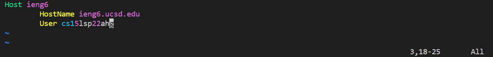  

> ### Logging in with ```ssh``` and Alias  
> 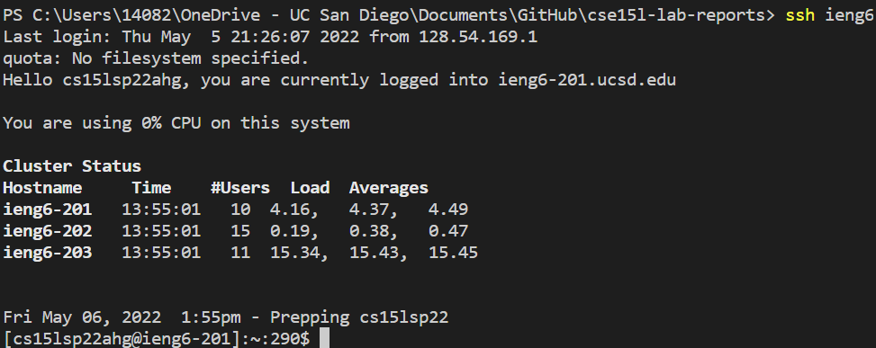  

> ### Copying with ```scp``` and Alias  
> 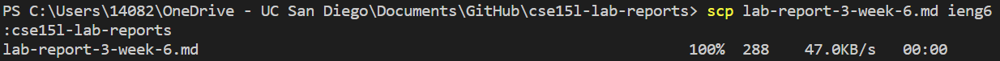  
> 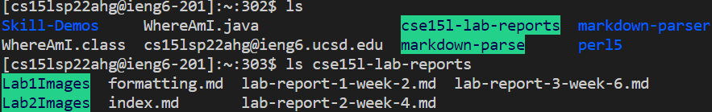  
## __Setup Github Access from ieng6__  
> ### Public key  
> .png)  

> ### Private key  
>   

> ### Git commit commands  
> 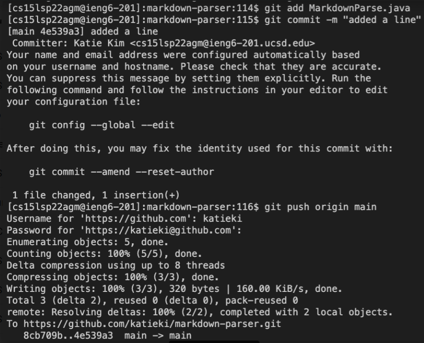  
> [Commit link](https://github.com/katieki/markdown-parser/commit/4e539a32e220d8cecb0b332e780dfc0d0095c679)  
## __Copy whole directories with ```scp -r```__  
> ### Copying the whole markdown-parser directory  
> 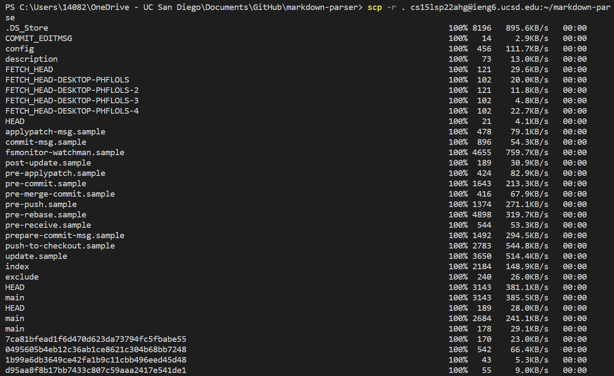  
> 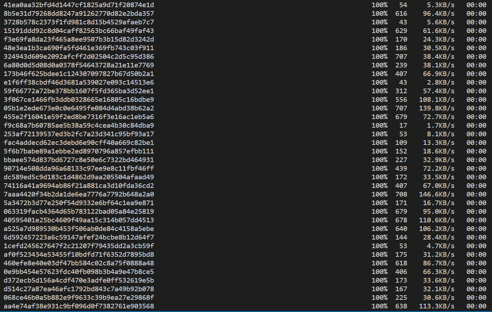  
> 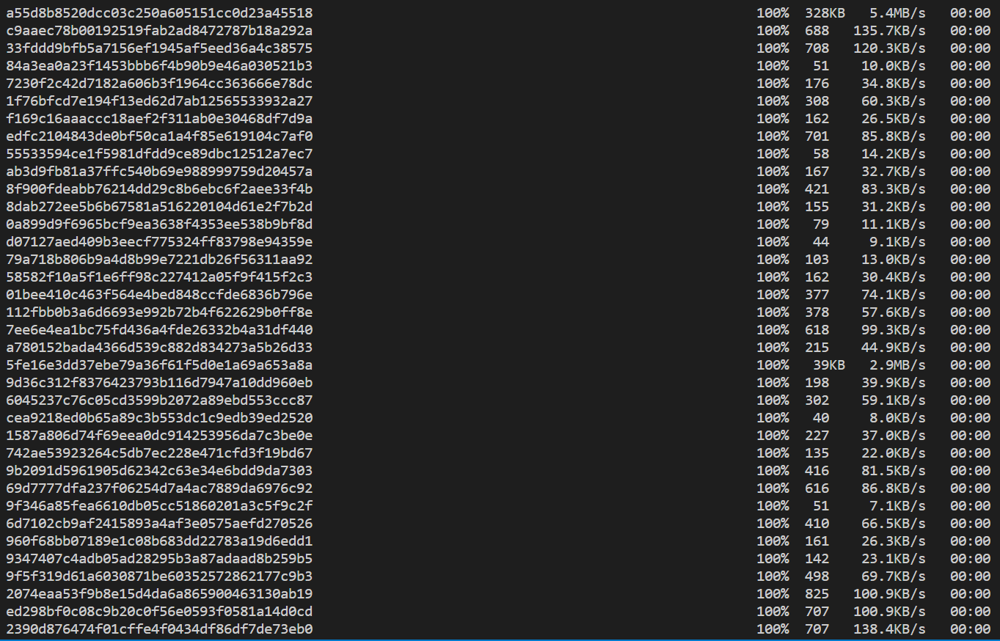  
> 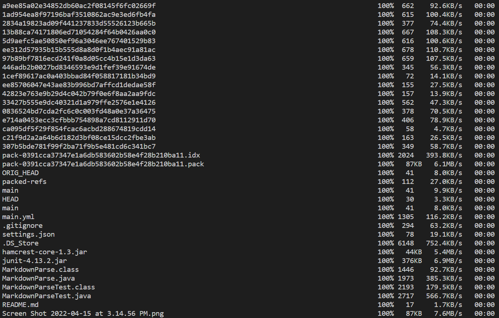  
> 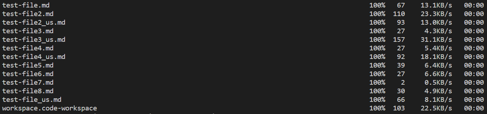  
> 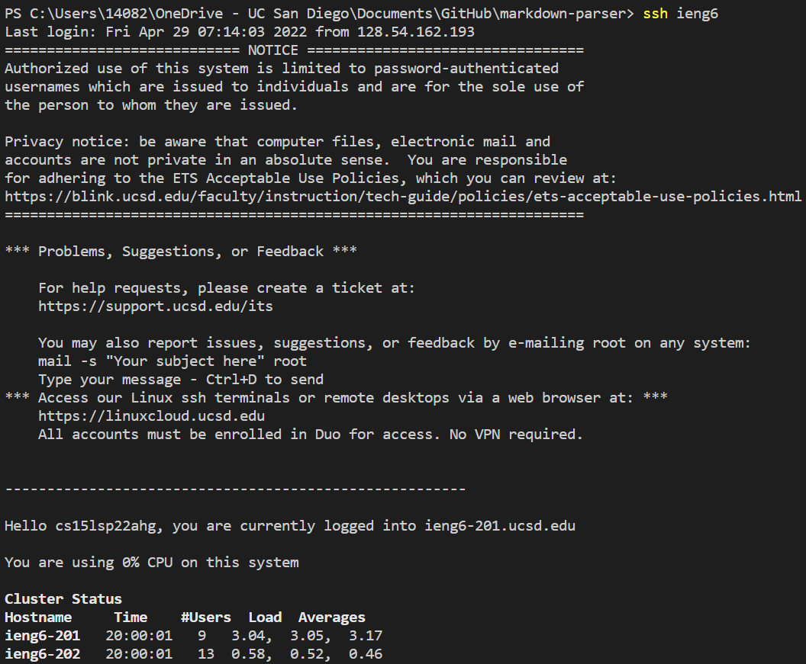  

> ### Logging in to ieng6 after copying  
> There was the line ```ssh ieng6``` before this  
> 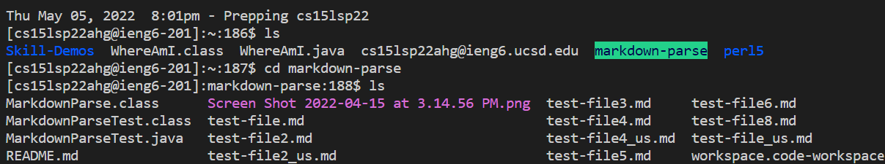  
> The directory was later renamed to markdown-parser  
> 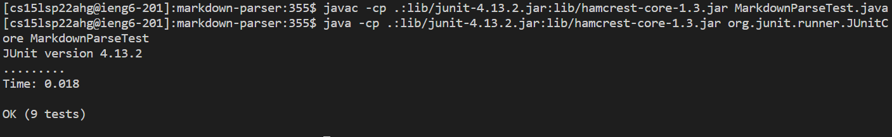

> ### Remote access and copying using one line
> 
> 
> 
> 
> 
> 
> 