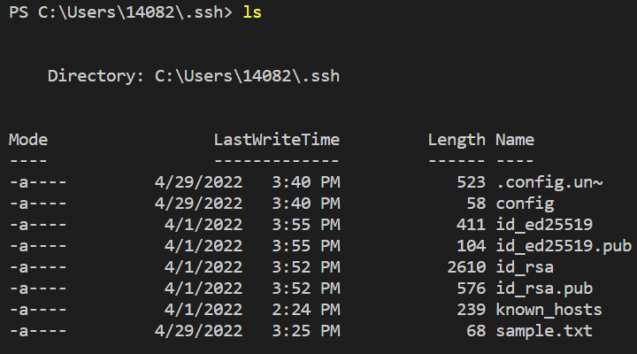

# [Lab Report 3](lab-report-3-week-6.html)

## __Streamlining ssh Configuration__
> ### .ssh config file  
> * Editor used for config file: ```vim```  
> * config was created in .ssh on my local computer using vim.  
>   

> ### Logging in with ```ssh``` and Alias  
> * I logged into the ieng6 server using ssh and the key made in the config file.  
>   

> ### Copying with ```scp``` and Alias  
> * I copied the file lab-report-3-week-6.md into the cse15l-lab-reports repository on the ieng6 server.  
>   
>   

## __Setup Github Access from ieng6__  
> ### Public key  
> * The public key was stored in the config file in .ssh.
> .png)  

> ### Private key  
> * The private key was also stored in .ssh but in the id_rsa file.
>   

> ### Git commit commands  
> The commands:
> * ```git add <filename>```
> * ```git commit -m "message"```
> * ```git push origin main```
>   
> [Commit link](https://github.com/katieki/markdown-parser/commit/4e539a32e220d8cecb0b332e780dfc0d0095c679)  
## __Copy whole directories with ```scp -r```__  
> ### Copying the whole markdown-parse directory  
> The entirety of the markdown-parse directory was copied into ieng6 recursively using the argument -r.
>   
>   
>   
>   
>   
>   

> ### Logging in to ieng6 after copying  
> * As shown below, markdown-parser was correctly copied.
> There was the line ```ssh ieng6``` before this  
>   
> The directory was later renamed to markdown-parser  
> 

> ### Copying and remote access using one line
> * The scp copies the directory.
> * The commands are separated by semicolons.
> * The ssh ieng6 "commands" runs the commands in the quotes on ieng6 remotely.
> 
> 
> 
> 
> 
> 
> 