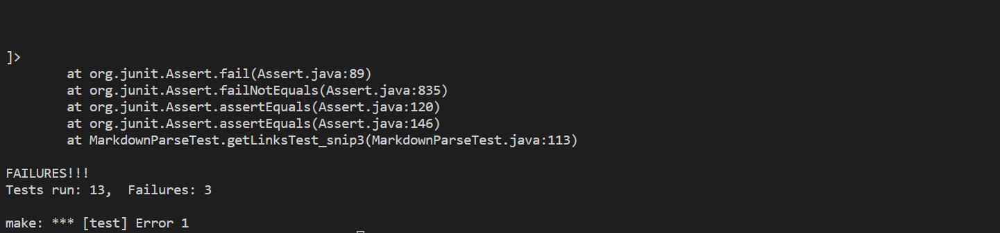
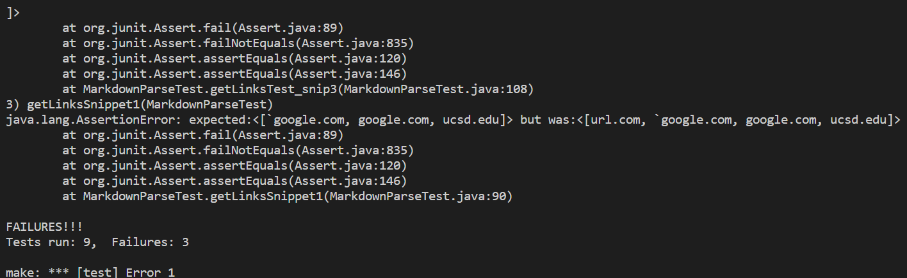

# [Lab Report 4](lab-report-4-week-8.html)

> What should have been returned:   
> * Snippet 1:   
> ```[`google.com, google.com, ucsd.edu]```
> * Snippet 2:   
> ```[a.com(()), example.com]```
> * Snippet 3:
> ```[https://www.twitter.com, https://sites.google.com/eng.ucsd.edu/cse-15l-spring-2022/schedule, https://cse.ucsd.edu]```

## The 3 added tests:


## Tests on my group's [MarkdownParse](https://github.com/katieki/markdown-parser)
> Group members: Christine Tang, Katie Kim, Linjun Liu   
>    
> 
> None of the 3 tests passed. No errors were thrown, but the outputs were incorrect. 
> Our outputs:   
> * Snippet 1:
> ```[url.com, `google.com, google.com]```   
> * Snippet 2:   
> ```[a.com, a.com((]```   
> * Snippet 3:   
> ```[```   
> ```    https://www.twitter.com```   
> ```,```   
> ```https://sites.google.com/eng.ucsd.edu/cse-15l-spring-2022/schedule```   
> ```, https://cse.ucsd.edu/```     
> ```]```

## Tests on reviewed group's [MarkdownParse](https://github.com/henrigy/markdown-parser/)
> 
> 
> None of the 3 tests passed. No errors were thrown, but the outputs were incorrect. Their outputs:
> * Snippet 1:
> ```[url.com, `google.com, google.com, ucsd.edu]```
> * Snippet 2:
> ```[a.com, a.com((, example.com]```
> * Snippet 3:
> ```[```   
> ```    https://www.twitter.com```   
> ```,```   
> ```https://sites.google.com/eng.ucsd.edu/cse-15l-spring-2022/schedule```   
> ```, github.com```   
> ```And there's still some more text after that.```   
> ```[this link doesn't have a closing parenthesis for a while](https://cse.ucsd.edu/```   
> ```]```

## Debugging the issue
> ### Backtick: 
> I do not think that the backtick issues would be easily solvable because it involves making sure the backtick inside is the second backtick of a pair.
> As can be seen in snippet 1 with the case of ``` `google.com```, the backticks are not supposed to be removed in general, just in specific cases, so this should not be a one-line fix.
> ### Nested parentheses, brackets, and escaped brackets:
> I do think that these could be fixed within 10 lines, though it would be rather difficult. I'd say it would be easier to use a helper method to help retrieve escaped brackets in such cases.
> ### Snippet 3 issues
> I think it can be fixed within 10 lines just by adding a helper method that removes spaces and new lines from links in general. 