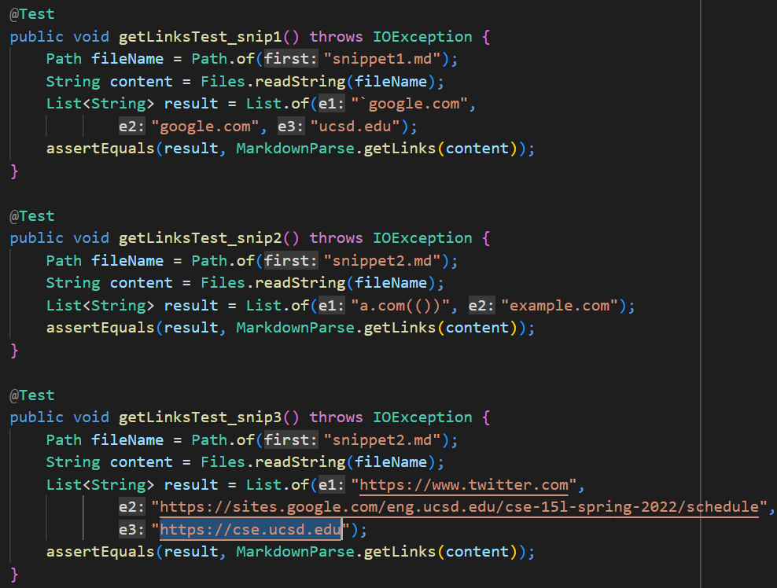
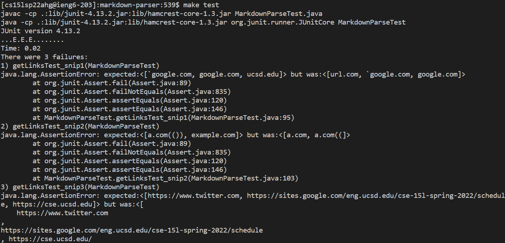
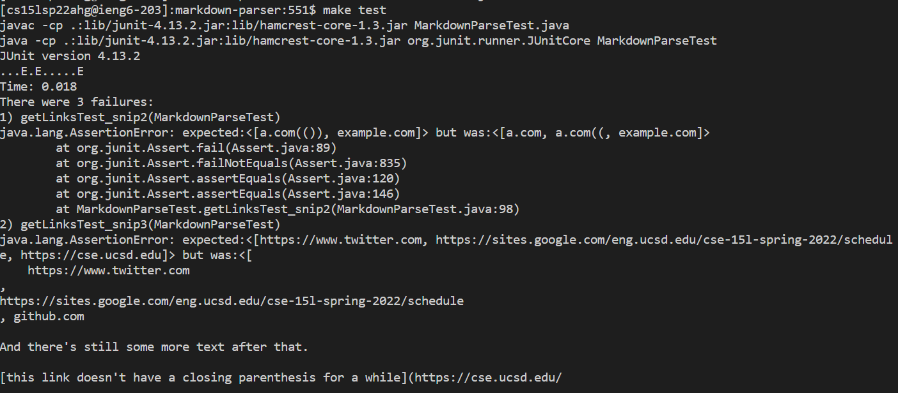

# [Lab Report 4](lab-report-4-week-8.html)

> What should have been returned:   
> * Snippet 1:   
> ```[`google.com, google.com, ucsd.edu]```
> * Snippet 2:   
> ```[a.com(()), example.com]```
> * Snippet 3:
> ```[https://www.twitter.com, https://sites.google.com/eng.ucsd.edu/cse-15l-spring-2022/schedule, https://cse.ucsd.edu]```

## The 3 added tests:


## Tests on my group's [MarkdownParse](https://github.com/katieki/markdown-parser)
> Group members: Christine Tang, Katie Kim, Linjun Liu   
>    

## Tests on reviewed group's [MarkdownParse](https://github.com/henrigy/markdown-parser/)
> 
