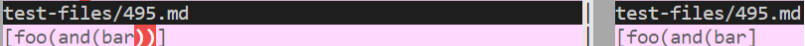
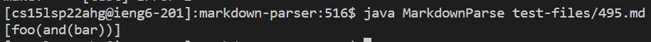
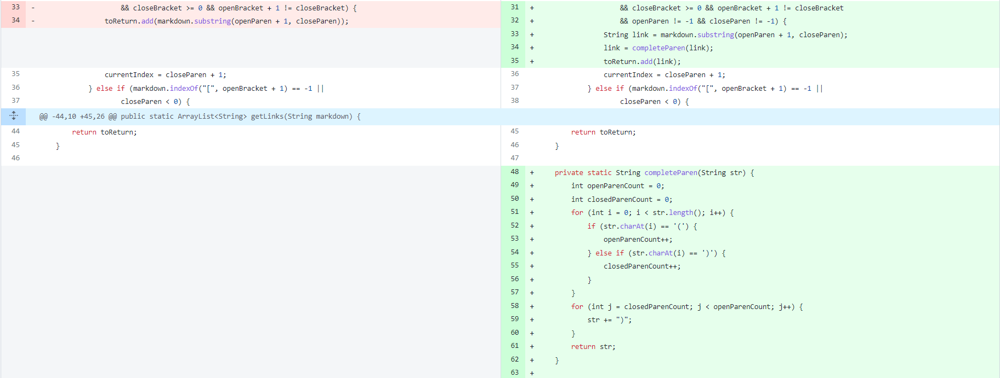
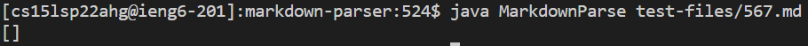

# [Lab Report 5](lab-report-5-week-10.html)

## Bug 1
> [Test file link](https://github.com/nidhidhamnani/markdown-parser/blob/main/test-files/495.md)   
> The professor's implementation is correct (the one shown on the left). The closing parentheses should have been added when there were open parentheses without closing parentheses.    
> Correct output: ```[foo(and(bar))]```   
> Script to generate results files:      
> ```
> cd markdown-parser-latest   
> bash script.sh > results.txt   
> cd ..      
> cd markdown-parser   
> bash script.sh > results2.txt 
> ```
> Vimdiff command used: ```vimdiff markdown-parser-latest/results.txt markdown-parser/results2.txt```     
> ### Output difference found using vimdiff:      
>       
> ### Output after debugging:     
>     
> A method needed to be added in order to fix the parentheses before adding to the list of links. This helper method added missing closing parentheses.
> ### Code changes made to debug:
> 

## Bug 2
> [Test file link](https://github.com/nidhidhamnani/markdown-parser/blob/main/test-files/567.md)   
> The professor's implementation is correct (the one shown on the left). The link should not have been added since it was invalid due to the spaces in the link.     
> Correct output: ```[]```   
> Script to generate results files:      
> ```
> cd markdown-parser-latest   
> bash script.sh > results.txt   
> cd ..      
> cd markdown-parser   
> bash script.sh > results2.txt 
> ```
> Vimdiff command used: ```vimdiff markdown-parser-latest/results.txt markdown-parser/results2.txt``` 
> ### Output difference found using vimdiff:      
>       
> ### Output after debugging:     
>     
> An if statement needed to be added in order to prevent the addition of an invalid link with spaces.
> ### Code changes made to debug:
> 